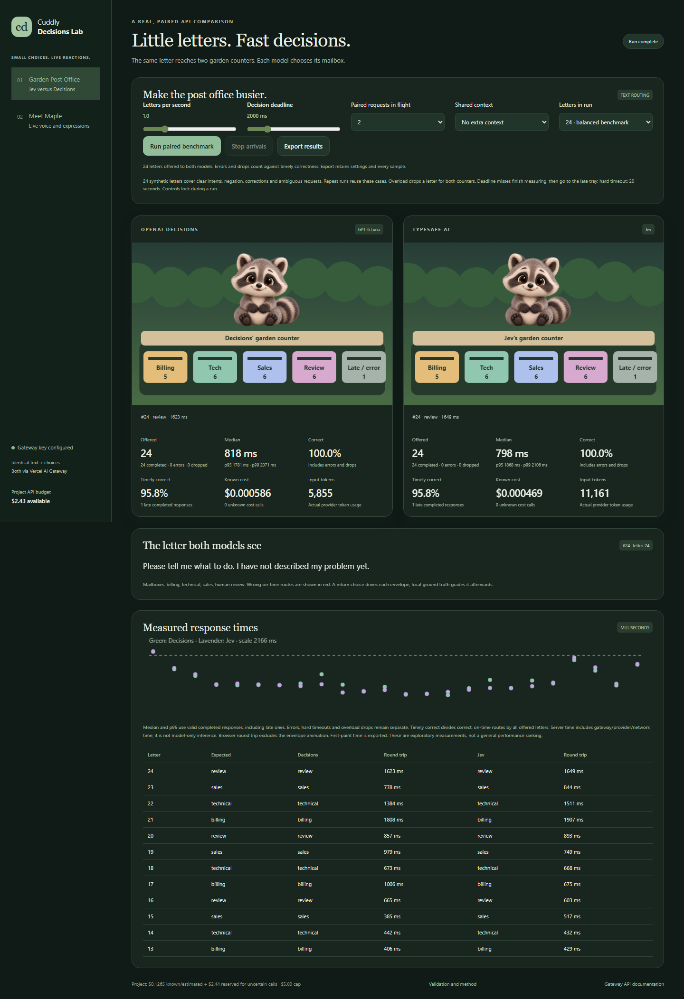
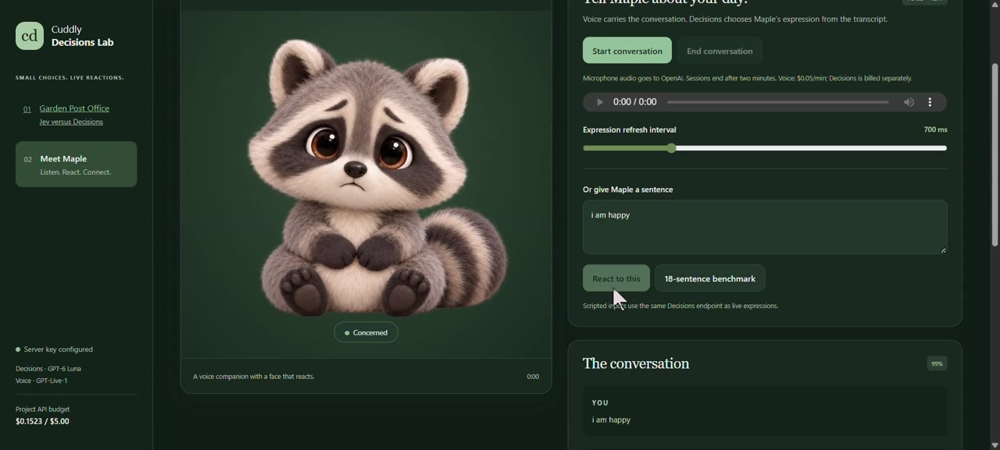

# Decisions API vs Jev — Cuddly Decisions Lab

Two animated tests make model decisions visible: a paired mail-routing benchmark and a talking raccoon named Maple.



**[Watch the video](https://az9713.github.io/decisions_api_vs_jev/)** · **[Run locally](#run-locally)** · **[Garden Post Office](http://127.0.0.1:3087/)** · **[Meet Maple](http://127.0.0.1:3087/maple.html)**

The local links work after you start the server. GitHub README pages cannot execute the games or embed a native video player. The clickable video preview below opens the hosted GitHub Pages player; no local server is needed to watch it. Live API tests still require the local backend.

## Watch Maple react

[](https://az9713.github.io/decisions_api_vs_jev/)

**[Play the 44-second demo](https://az9713.github.io/decisions_api_vs_jev/)** · [Direct MP4](https://az9713.github.io/decisions_api_vs_jev/video/demo1.mp4)

The recording is compressed from 38.9 MB to 1.27 MB (96.7% smaller), retaining 1920×866 resolution, 30 fps and audio. The original recording remains local; the compressed copy is committed under `docs/video/demo1.mp4`. GitHub Pages publishes the `docs/` folder. Playback and seeking are checked with `node tests/video-browser.mjs`; pass the hosted page URL to test the deployment. This check requires Playwright and installed Google Chrome.

## 1. Garden Post Office: Jev versus Decisions

Identical customer letters arrive at two animated garden counters. Each model chooses one of four mailboxes:

| Mailbox | Handles |
| --- | --- |
| Billing | Payments, refunds, invoices and subscription cancellations |
| Technical | Broken features, errors, login failures and outages |
| Sales | Quotes, demos, purchasing and upgrades |
| Human review | Unclear, unrelated or equally active multiple requests |

The returned choice sends an envelope into that mailbox. Wrong routes appear red. Responses after the chosen deadline go to the late tray, even if their classification is correct.

Both models use Vercel AI Gateway's OpenAI-compatible `POST /v1/decisions` endpoint:

| Counter | Model | Fixed provider |
| --- | --- | --- |
| Decisions | `openai/gpt-6-luna-decisions` | OpenAI |
| Jev | `typesafe-ai/jev` | TypeSafe AI |

Every pair receives the same text, instructions and choices. Dispatch order alternates. Expected answers stay in the browser and grade the returned choice afterwards. No application retries or model fallbacks are configured; provider routes are pinned, and gateway attempt metadata is retained in exports.

### Try it

1. Open Garden Post Office and click **Run paired benchmark**.
2. Watch the envelopes route independently as the two responses arrive.
3. Increase **letters per second**, shorten the **decision deadline**, or add **shared context** to stress latency.
4. Change the paired in-flight limit to examine concurrency. Controls lock during a run; stop arrivals and let existing work drain before changing settings.
5. Export JSON and CSV to inspect settings and individual samples.

Runs offer 8, 24, or 48 letters. There are 24 balanced synthetic cases: clear intents, negation, corrections and ambiguity. The 48-letter option repeats the dataset; those repeats are not independent new examples.

The app bounds simultaneous work to three pairs. If capacity is occupied, an arriving letter is dropped for both models. This shared admission rule preserves paired inputs; it does **not** measure each model's independent maximum throughput. Stopping or hiding the tab stops new arrivals and allows existing requests to finish.

### What the numbers mean

- **Round trip:** browser request start through the parsed local-server response. Includes local middleware, gateway, provider and network time.
- **Median / p95 / p99:** valid completed responses, including late completions. Errors, hard timeouts and overload drops are counted separately.
- **Correct:** correct results divided by all offered letters, including failures and drops.
- **Timely correct:** correct results returned by the deadline divided by all offered letters.
- **First-paint time:** arrival to the first animation-frame draw of the returned route, exported per sample. This excludes envelope landing time and is not a compositor presentation timestamp.
- **Cost / tokens:** gateway-reported cost and provider token usage; token-price estimates are used only when gateway cost is absent.

A short deadline does not cancel measurement. Late requests finish and remain in the latency distribution. A separate 20-second hard timeout aborts stuck requests; their completed latency is unknown. Show timeout and drop counts alongside percentiles.

### Verified live example

A 24-letter run on October 8, 2026 UTC, at one letter/second, three paired requests in flight and a 2,000 ms deadline:

| Metric | Decisions | Jev |
| --- | ---: | ---: |
| Completed | 24/24 | 24/24 |
| Correct | 24/24 | 24/24 |
| Median round trip | 818 ms | 798 ms |
| p95 round trip | 1,781 ms | 1,868 ms |
| Timely correct | 23/24 | 23/24 |
| Gateway cost | $0.0005855 | $0.000468762 |

No errors, drops, provider fallback attempts or application retries occurred. These are small, machine/network-specific observations, not evidence that one model is generally faster. Sanitized samples and methodology are in [postoffice-results.json](public/postoffice-results.json) and the local [validation page](http://127.0.0.1:3087/postoffice-validation.html).

## 2. Meet Maple: live voice and expression decisions

Maple is the approved plush raccoon artwork with six visible reactions: neutral, delighted, concerned, surprised, thoughtful and excited.

1. Open **Meet Maple**.
2. Choose **Start conversation**, allow microphone access, speak and listen to Maple's response.
3. The live transcript drives expression choices through OpenAI Decisions.
4. End the conversation to finalize usage. Sessions have a two-minute limit.
5. Alternatively, enter a sentence or run the **18-sentence benchmark** without speaking.

Speech uses OpenAI `gpt-live-1` over WebRTC. Expression selection uses direct OpenAI `gpt-6-luna` Decisions requests. Decisions chooses the face; the separate voice API generates speech. Maple currently tests OpenAI only; the paired Jev comparison is Garden Post Office.

Maple reports expression round trip, transcript-to-expression draw time, voice setup time, scripted label agreement and cost. Transcript timing starts at the latest included text fragment, not microphone capture. It does not measure full microphone-to-expression or speech playback latency. Synthetic emotion labels are illustrative, not psychological ground truth.

The latest live check matched all 18 scripted labels and finalized a 29-second speech-fixture session with received audio, advancing playback and transcript-driven expression changes.

Automated voice validation uses a local speech fixture and checks received audio packets, advancing playback, input/output transcripts, expression updates and finalized session usage. A human should still assess microphone behavior and conversational audio quality.

## Run locally

Requires Node.js 22.6+ and API access to the relevant models.

```bash
git clone https://github.com/az9713/decisions_api_vs_jev.git
cd decisions_api_vs_jev
npm ci
```

Copy `.env.example` to `.env` and fill in your credentials:

```dotenv
OPENAI_API_KEY=your_openai_key
AI_GATEWAY_API_KEY=your_vercel_ai_gateway_key
```

The existing configuration name `VERCEL_AI_GATEWAY_KEY` is also supported. Gateway calls use the gateway credential; Maple needs the OpenAI credential. Credentials remain on the server.

```bash
npm start
```

Open **http://127.0.0.1:3087/** in Chrome or Edge. The server binds to the local loopback interface. If Codex's in-app browser stays blank, use a normal browser; an HTTP health check alone does not establish that the in-app browser rendered the page. Restart the server after editing `.env`.

The app loads artwork locally and adds no UI framework. Its only production dependency is `ws` for voice-session events.

## Verify it

```bash
npm test
npm run test:browser
```

These are nonbillable server and browser checks. Browser tests need Playwright and Chromium. On a new machine:

```bash
npm install --no-save playwright
npx playwright install chromium
```

The test runner also discovers this workstation's bundled Playwright runtime and Chromium. Set `PLAYWRIGHT_CHROMIUM_PATH` if needed.

Explicit live validation makes billable calls:

```bash
npm run test:live
npm run test:maple
```

`test:live` runs the 24-letter paired benchmark and checks model identities, gateway generation IDs, costs and UI behavior. `test:maple` checks 18 expression cases and a speech-fixture conversation. Tests write evidence locally; runtime evidence is not committed.

The rabbit is set aside and preserved at `/legacy-rabbit.html`. Its vision-latency limitations are not acceptance criteria for the two current tests. Optional historical checks are `npm run test:legacy` and `npm run test:recovery`.

## Budget and data

The server's persistent `data/budget.jsonl` ledger enforces a $5 project cap. It reserves $0.02 before each decision request. Known costs settle reservations; uncertain transport failures retain them across restarts. The voice estimate is $0.05 per finalized minute. Token estimates use the verified catalog rates of $0.10/M for Decisions and $0.042/M for Jev. These are application accounting assumptions, not a billing statement.

Do not delete the ledger to reset spending. It covers requests made through this project, not other apps using your keys.

Server logs omit keys, raw messages, screenshots and audio. Browser exports contain sample settings, classifications, timings and gateway metadata. Local credentials, ledgers, logs, original transcripts and raw validation evidence are excluded from Git.

## Sources and project scope

Inspired by the [OpenAI Decisions demo video](https://www.youtube.com/watch?v=FB6oCmrIj-Y). The raccoon adapts its emotion demo. Garden Post Office is this project's text-routing adaptation, suitable for a paired text-only comparison. Development used the saved transcript and storyboard references; full video playback was unavailable.

- [Vercel OpenAI-compatible Decisions API](https://vercel.com/docs/ai-gateway/sdks-and-apis/openai-decisions)
- [Vercel provider routing controls](https://vercel.com/docs/ai-gateway/models-and-providers/provider-options)
- [Vercel model catalog](https://ai-gateway.vercel.sh/v1/models)
- [OpenAI Decisions guide](https://developers.openai.com/api/docs/guides/decisions)
- [TypeSafe documentation](https://docs.typesafe.ai/)

The selected raccoon artwork is included in the app. No new image-generation calls are needed to run either test.
